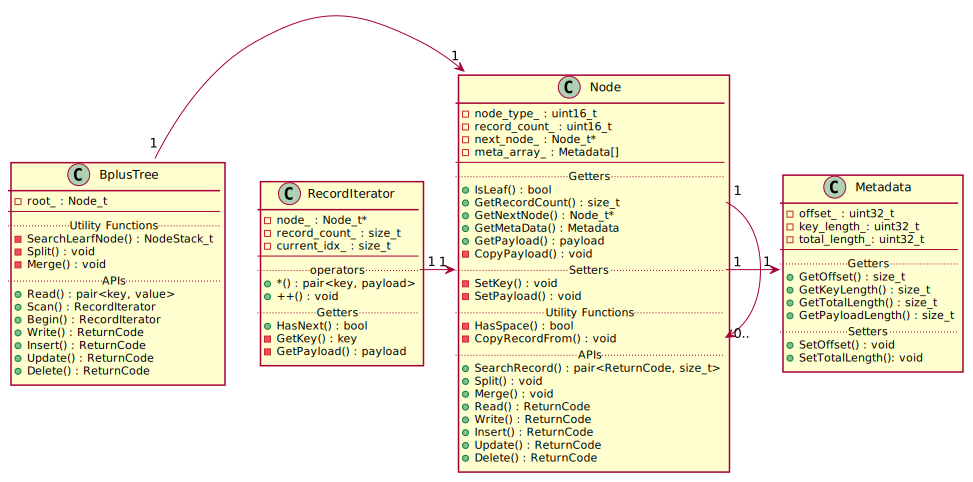
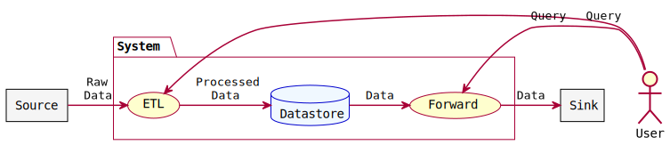
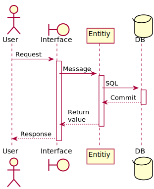

# 機能定義書 <!-- omit in toc -->

<!-- 全体概要．-->
B+tree．

- [クラス図](#クラス図)
    - [BpulsTreeクラス](#bpulstreeクラス)
    - [Nodeクラス](#nodeクラス)
    - [Metadataクラス](#metadataクラス)
    - [RecordIteratorクラス](#recorditeratorクラス)
## クラス図

### BpulsTreeクラス
B+tree本体のクラス．
各問合わせのAPIを持ち，木の構造変更を行う．

### Nodeクラス
B+treeのノードクラス．
ヘッダーとメタデータ，レコードを持つ．

### Metadataクラス
ノード内のメタデータ．
オフセット，キー長，全長という，レコードにアクセスするための情報を持つ．

### RecordIteratorクラス
レコードのイテレータ．
スキャンのために使用．

<!-- 
## データフロー図

概要．

## 機能一覧

### 機能1

概要．

#### シーケンス図

#### 処理詳細

1. 手順1：
    - 補足．
2. 手順2：
    - 補足．
3. 手順3：
    - 補足．
-->
